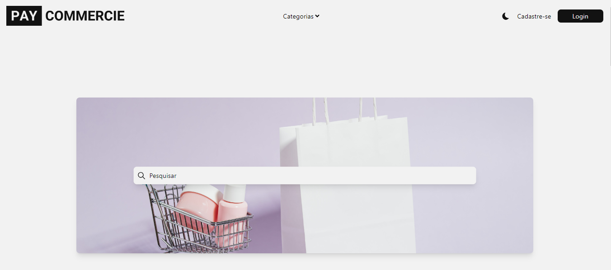

# Pay Commercie

## About
`Pay Commercie` is an e-commerce project that I created to exercise my abilities and learn new skills.

In this project, I proposed the use of `Tailwindcss` (a styling library) and `Bun` (a Software runtime that executes JavaScript) because I wanted to learn how to use these features.

## Features
- Front-end: NextJS
- Back-end: Bun with TypeScript
- Database: MySQL on docker in a locale hosted VM
- Virtual Machine: O.S used Ubuntu Server 22.04.04 LTS

## Some Informations

### Home Page
Route: `http://localhost:3000`

The `Home Page` shows some information such as:

- `Categories` to filter the products by category and redirect to that category page.
- `Search Bar` to search for any products from the store.
- Displays some products like `Products with discounts`.

### Product Categories Page
Route: `http://localhost:3000/products?categorias=camisas`

When a category is selected on the `Home Page`, the site is redirects to this page.

This page shows all the products in the selected category.

### Product Page
Route: `http://localhost:3000/product/product-id`

This page shows detailed information about the selected product, including:
- Product name
- Product description
- Price
- A selection for your assessment
- Some assessments

You can add the product to the `Shopping Cart` or `My List` and if you want, you can purchase the product directly.

### Shopping Cart Page
Route: `http://localhost:3000/shopping-cart`

this page is the Shopping Cart. You can add discount coupons, complete the purchase, and clean the shopping cart.

### My List Page
Route: `http://localhost:3000/my-list`

Here are the products that you added to `My List`.

### Other Features

there are other features such as: `Register`, `Login` and `Dark and Light Theme`.

## Final Considerations

Overrall, it was good to make this project. I trained my existing skills a bit more and learned new ones, such as styling with `Tailwindcss` and some features of `Bun`.
